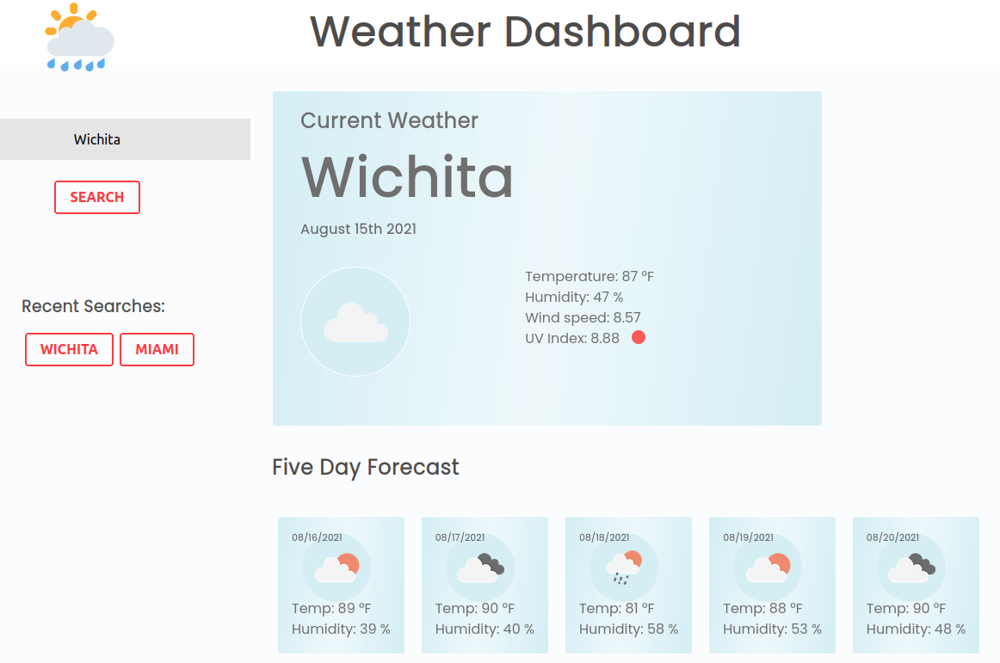
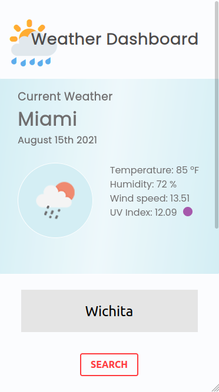

# Weather Dashboard

## Table of contents

- [General info](#general-info)
- [Screenshots](#screenshots)
- [Technologies](#technologies)
- [Setup](#setup)

## General info

A responsive weather dashboard.

## Screenshots

## Technologies

Project is created with:

- HTML
- CSS
- JavaScript
  - jQuery
  - Moment.js
- OpenWeather 5 day / 3 hour weather forecast
- OpenWeather UV Index

## Setup

To run this project, open the following URL in any modern web browser:

https://gregstead.github.io/06_weather_dashboard/

The GitHub repository is located at:

https://github.com/gregstead/06_weather_dashboard
